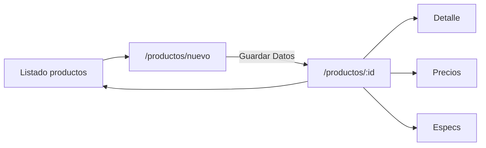
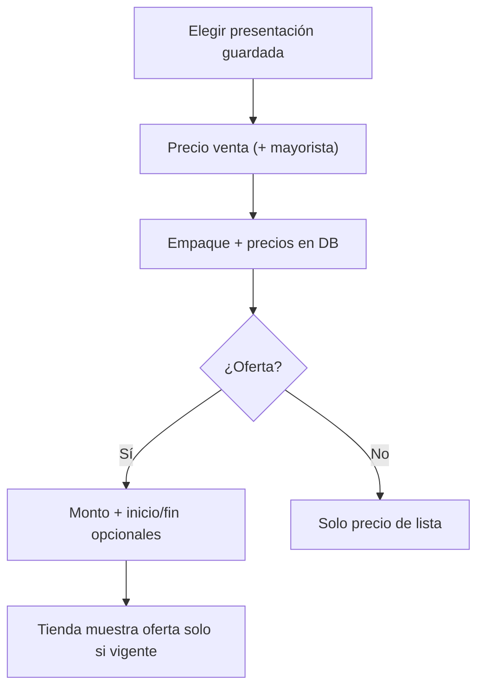

# Proyecto Rosver SAC — Resumen completo

**Fecha del documento:** 2026-09-11  
**App:** RosverSac (versión ~0.1.43)  
**Repo:** Rosver-Web · ERP interno **SystemRSV**

Este documento explica **qué es el sistema**, **cómo está construido** y **qué se realizó** en el trabajo reciente (ficha de producto CRM, presentaciones y ofertas con fechas).

---

## 1. Qué es el proyecto

**Rosver SAC** es un sistema web para una empresa de **importaciones** con dos caras en la misma aplicación:

| Cara | Quién lo usa | Para qué |
| --- | --- | --- |
| **Tienda / catálogo público** | Visitantes y clientes | Ver productos, cotizar, armar carrito/pedido, contacto, libro de reclamaciones |
| **ERP SystemRSV (`/admin`)** | Admin y comercial | Gestionar catálogo, precios, pedidos, cotizaciones, usuarios, medios |

### Objetivos de negocio

1. Digitalizar el catálogo de importaciones (productos, marcas, categorías, presentaciones).
2. Captar leads y pedidos desde la web (cotizaciones, carrito, WhatsApp).
3. Dar al equipo interno un panel tipo SaaS (SystemRSV) para operar el día a día.
4. Mantener una sola fuente de verdad: lo que se publica en admin se refleja en la tienda.

### Enfoque de desarrollo

1. **Visual primero** — pantallas, UX, marca Rosver.
2. **Lógica después** — API, Postgres, auth, reglas de negocio.
3. Documentación viva en `docs/` para que cualquier agente o persona retome el avance.

---

## 2. Arquitectura técnica

### 2.1 Stack

| Capa | Tecnología |
| --- | --- |
| Frontend | React 19, TypeScript, Vite, Tailwind v4, Motion, React Router |
| Backend | Hono (Node), Zod, Argon2, OTP / TOTP |
| Base de datos | PostgreSQL (local `rosver_local` / Railway en prod) |
| Caché | Redis (destacados home, etc.) |
| Media | Cloudflare R2 (imágenes, evidencias, PDFs) |
| Deploy | Railway (web + API + Postgres); dominio previsto `rosversac.com` |

### 2.2 Estructura de código

```
RosverSac/
  src/
    app/          → shell, rutas, layouts (público + admin)
    features/     → módulos de producto (catalog, cart, auth, admin-*, …)
    shared/       → UI, hooks, lib compartidos
    styles/       → tokens de marca (paleta Rosver)
  server/
    src/          → API Hono, rutas, libs
    sql/          → migraciones 001…031+
```

**Reglas de capas:** `app` → `features` → `shared`. Una feature no importa internos de otra; solo su `index.ts`.

### 2.3 Rutas principales

| Zona | Rutas |
| --- | --- |
| Público | `/`, `/catalogo`, `/producto/…`, `/carrito`, `/cotizar`, contacto, reclamaciones |
| Auth | `/login`, `/registro`, OTP, recuperar |
| Cliente | `/cuenta/*` (perfil, pedidos, cotizaciones) |
| Admin | `/admin/*` (SystemRSV) |

Local: UI `localhost:5173` · API `localhost:8787` (proxy `/api`).

---

## 3. Marco conceptual (términos del dominio)

Útil para documentación académica o onboarding.

### 3.1 Conceptos de producto

| Concepto | Definición en Rosver |
| --- | --- |
| **Producto** | Ítem de catálogo (SKU, nombre, marca, categoría, foto, specs). |
| **Código interno** | Número correlativo de sistema (8 dígitos visuales), distinto del SKU comercial. |
| **Presentación** | Plantilla global: **tipo de unidad** (Caja, Unidad…) + **cantidad** (×1, ×12…). Se define en Presentaciones. |
| **Empaque / packaging** | Presentación **asignada a un producto concreto** con sus precios. |
| **Precio de lista (venta)** | Precio público base (`price_kind = list`). |
| **Mayorista** | Precio opcional (`wholesale`). |
| **Oferta** | Precio promocional (`offer`), puede tener **ventana de fechas**. |
| **Vigencia** | `valid_from` / `valid_to`: si están vacíos, la oferta vale siempre; si hay fechas, la tienda solo la muestra dentro del rango. |
| **Ficha CRM** | Página completa de alta/edición (no modal) con cabecera, fases y preview. |
| **SystemRSV** | Nombre del ERP admin (sidebar blanca, top bar, cards Rosver). |

### 3.2 Fundamento del diseño

- **Catálogo + backoffice en un solo sistema:** evita doble carga de datos.
- **Presentaciones reutilizables:** se definen una vez y se eligen al poner precio al producto.
- **Ofertas temporales:** lógica de descuento por tiempo limitado sin borrar el precio de lista.
- **UX ERP en modal** para módulos cortos; **excepción productos** → ficha página completa por complejidad (datos, detalle, precios, specs + preview).
- **Paleta de marca Rosver** (rojo `#E30613`, ink, soft, success…) obligatoria en toda la UI.
- **Toasts tipados** para validación (sin mensajes nativos del browser).

---

## 4. Módulos del sistema

### 4.1 Tienda pública

- Catálogo con filtros, categorías, marcas.
- Ficha de producto, carrito, PDF de cotización / pedido.
- Auth (login, registro, OTP, 2FA).
- Área `/cuenta` (pedidos y cotizaciones reales vía API).
- Contacto, WhatsApp flotante, libro de reclamaciones.
- Catálogo PDF / assets de marca.

### 4.2 ERP SystemRSV (`/admin`)

| Módulo | Función |
| --- | --- |
| **Productos** | Listado + ficha CRM (crear/editar) |
| **Presentaciones** | Tipos de unidad y cantidades (cascada) |
| **Categorías / Marcas / Ofertas** | Taxonomía y promos (forms en modal) |
| **Pedidos / Cotizaciones** | Pipeline CRM por fases + evidencias |
| **Reclamaciones** | Gestión de hojas |
| **Usuarios** | Roles y estado |
| **Almacenamiento** | Medios en R2 |
| **Contenido** | Bloques / home (según avance) |

---

## 5. Trabajo realizado (sesión / avance reciente)

### 5.1 Producto en ficha CRM (sin modal) — change `0218`

**Problema:** el alta/edición de productos en un modal wizard era estrecho e incómodo (muchas fases + preview).

**Solución:** patrón tipo CRM / Urbany.

```
/admin/productos              → solo listado (tabla)
/admin/productos/nuevo        → ficha alta
/admin/productos/:id          → ficha edición
```

**UI de la ficha (`AdminProductWorkspacePage`):**

1. **Cabecera:** volver, foto, nombre, SKU, código interno, marca, badge Visible/Oculto, Guardar / Ocultar.
2. **Fases:** Datos · Detalle · Precios · Especs.
3. En **nuevo**, solo Datos hasta crear; luego redirige a `/:id` y habilita el resto.
4. **Preview** de la card de tienda (sticky en desktop).

**Reglas actualizadas:** excepción en regla `17` — Productos = página completa; el resto de módulos cortos siguen en `AdminModal`.

### 5.2 Presentaciones guardadas + precio + oferta con fechas — change `0219`

**Problema:** en Precios se pedía otra vez tipo + cantidad (duplicando Presentaciones) y no había descuento temporal con fechas.

**Solución:**

1. Select de **presentaciones del catálogo** (`GET /api/admin/presentations`).
2. El usuario solo ingresa **precio de venta** (y mayorista opcional).
3. Oferta con **Inicio** y **Fin** (`datetime-local`).
4. Migración `031_product_price_validity.sql`: columnas `valid_from`, `valid_to` en `product_prices`.
5. La tienda filtra ofertas con `now()` dentro de la ventana (o sin fechas = siempre).

### 5.3 Corrección de carga de ficha (“No encontrado” / Cargando infinito)

**Causa:** el front hacía `Promise.all` incluyendo `/api/admin/presentations`. Si la API no se había reiniciado, respondía 404 genérico «No encontrado» y **nunca** abría el producto.

**Fix:**

- Presentaciones se cargan aparte (con fallback a tipos/cantidades).
- Si el producto falla, se muestra error + botón «Volver», no pantalla eterna de carga.
- API reiniciada en `:8787` con la ruta nueva.

---

## 6. Modelo de datos (resumen precios)

```
unit_types                    → Caja, Unidad, Paquete…
unit_type_quantities          → Caja × 12, Unidad × 1…   (plantillas globales)
product_packagings            → presentación ligada al producto
product_prices                → list | wholesale | offer | custom
  · amount, compare_at_amount
  · valid_from, valid_to      → vigencia de oferta (031)
```

Flujo operativo:

1. En **Presentaciones** se crean tipos y cantidades.
2. En **Producto → Precios** se elige una plantilla y se pone precio.
3. Opcionalmente se agrega **oferta** con o sin fechas.
4. El catálogo público lee precios activos y vigencia.

---

## 7. Flujos clave

### 7.1 Alta de producto



### 7.2 Precio y oferta



---

## 8. Infraestructura y entorno

| Entorno | Detalle |
| --- | --- |
| Local | Vite `:5173` + API `:8787` + Postgres local |
| Producción | Railway · URL pública del servicio Rosver-Web |
| Media | Cloudflare R2 |
| Auth | Sesión + OTP correo / autenticador |
| Migraciones | `server/sql/NNN_*.sql` aplicadas en boot / `npm run db:migrate` |

**Importante en desarrollo:** cambios de rutas API requieren **reiniciar** `npm run dev:api` (`tsx` no hace hot-reload).

---

## 9. Convenciones de calidad (obligatorias)

- Responsive: móvil, tablet, desktop (y altura corta).
- Paleta solo tokens Rosver.
- Iconos UI nuevos: `cssvg-icons`.
- Forms: `noValidate` + toasts (éxito / error / info / warning).
- ERP: forms en `AdminModal` excepto **Productos** (ficha CRM).
- Todo cambio cerrado → `docs/changes/NNNN-*.md` + pendientes.
- Deploy continuo: push `main` + Railway cuando se cierre release.

---

## 10. Estado actual y siguientes pasos

### Hecho (relevante a este documento)

- [x] Ficha CRM de productos (listado separado).
- [x] Presentaciones reutilizables al poner precio.
- [x] Ofertas con fechas de vigencia.
- [x] Corrección de carga de ficha / API presentations.
- [x] Pedidos, cotizaciones, cuenta, auth, catálogo vivo (trabajo previo documentado en `docs/changes/`).

### Pendiente / recomendado (ver `docs/pendientes/`)

- Google OAuth (credenciales).
- UI de reseñas desde cuenta cliente.
- Roles/permisos admin más finos en pantallas.
- Cutover DNS completo a `rosversac.com`.
- Import CSV / sync ERP externo.

---

## 11. Dónde está documentado el detalle

| Tema | Documento |
| --- | --- |
| Producto y audiencias | `docs/architecture/02-producto-rosver-sac.md` |
| Vistas y flujos | `docs/architecture/03-vistas-y-flujos.md` |
| Stack | `docs/architecture/04-stack-y-librerias.md` |
| Paleta | `docs/architecture/06-paleta-colores.md` |
| Deploy / R2 / Postgres | `docs/architecture/08-despliegue-y-almacenamiento.md` |
| UX ERP | `docs/architecture/09-erp-systemrsv-ux.md` |
| Historial de cambios | `docs/changes/` (p. ej. `0218`, `0219`) |
| Deudas abiertas | `docs/pendientes/PENDIENTES.md` |

---

## 12. Conclusión breve

Rosver-Web es un **catálogo B2B/B2C de importaciones** unido a un **ERP web SystemRSV**. El avance reciente cerró un flujo crítico de operación: **gestionar productos en ficha CRM**, **reutilizar presentaciones** y **programar descuentos por tiempo limitado**, con persistencia en Postgres y reflejo en la tienda pública.
